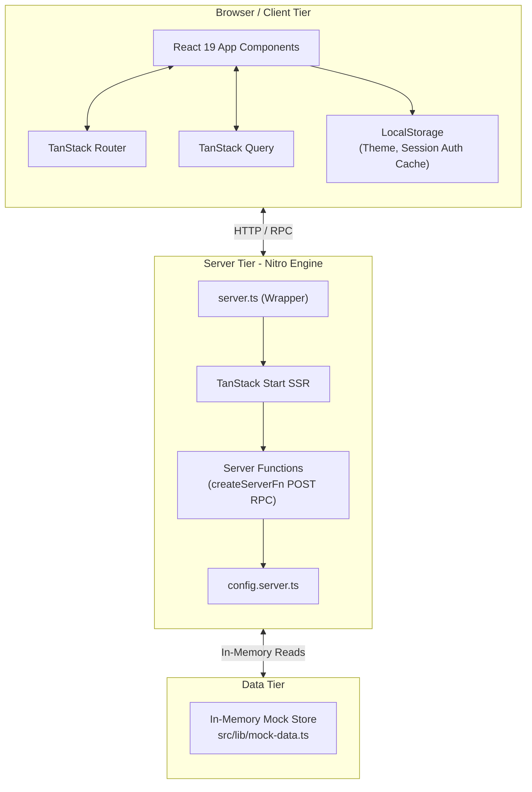

# Nippon Production Monitoring System (NPMS) — Panduan Onboarding Developer

Selamat datang di tim rekayasa perangkat lunak **PT. Indonesia Nippon Seiki**! Dokumen ini dirancang sebagai panduan komprehensif bagi senior engineer dan developer baru yang bergabung dalam proyek ini.

---

## 1. Ringkasan Proyek (Project Summary)

### Tujuan Bisnis (Business Purpose)
**Nippon Production Monitoring System (NPMS)** adalah dashboard operasi manufaktur perusahaan yang dirancang untuk memantau dan mengatur jalur perakitan di **PT. Indonesia Nippon Seiki**. Fokus utamanya adalah meningkatkan kontrol kualitas di lantai produksi, melakukan audit terhadap jalur produksi, dan menegakkan aturan konsumsi material yang ketat.

Kemampuan utama sistem meliputi:
- **Kepatuhan FIFO (First-In, First-Out)**: Mencegah penggunaan suku cadang yang tidak berurutan guna memastikan masalah penuaan inventaris tidak berdampak buruk pada kualitas produk.
- **Pelacakan Produksi (Production Tracking)**: Pencatatan waktu nyata (real-time) dari output jalur Sub-Assembly (Sub-Assy) dan Assembly (Assy).
- **Pengaturan Aliran Suku Cadang (Part-Input / Part-Out)**: Pemindaian suku cadang, pengelolaan posisi rak, dan pelacakan transfer suku cadang dari jalur produksi ke area penyimpanan.
- **Audit dan Pelaporan (Auditing and Reporting)**: Pembuatan ringkasan produksi, daftar pelanggaran FIFO, serta pencetakan log transaksi atau label produk.
- **Kontrol Akses Berbasis Peran (Role-based Access Control - RBAC)**: Menyediakan antarmuka pengguna (user interface) yang disesuaikan untuk Operator, Supervisor, dan Manager.

---

## 2. Diagram Arsitektur (Architecture Diagram - Mermaid)

Aplikasi ini dibangun menggunakan **TanStack Start**, sebuah framework React full-stack yang dikompilasi menjadi build serverless atau berkemampuan server yang ditenagai oleh **Nitro**.



### Ringkasan Komponen (Components Summary)

1. **Frontend**:
   - **Framework**: React 19 & TypeScript.
   - **Router**: TanStack Router (`routeTree.gen.ts` & `src/routes/`).
   - **Styling**: Tailwind CSS v4 & konfigurasi warna HSL/OKLCH khusus di `src/styles.css` (fitur penggantian tema gelap/terang).
   - **UI Komponen**: Primitif Radix UI dengan gaya Tailwind CSS (gaya Shadcn, dikonfigurasi di `components.json`).
   - **Charts**: Recharts untuk visualisasi kinerja lini produksi, delta KPI, dan tren kepatuhan FIFO.
2. **Backend**:
   - **Serverless/Server Engine**: Nitro (Beta 3) yang mengelola request HTTP dan aset statis.
   - **SSR Handler**: Mesin Server TanStack Start.
   - **RPC Layer**: Server functions (`createServerFn`) yang memungkinkan panggilan RPC asinkron langsung dari client ke server (contoh: `src/lib/api/example.functions.ts`).
3. **Database**:
   - Saat ini berstatus **Mock-only**. Tidak ada koneksi database persisten (seperti PostgreSQL atau Supabase) yang terhubung. Kumpulan data mock awal berada di `src/lib/mock-data.ts`.
   - Status sementara disimpan di dalam `localStorage` pengguna (seperti preferensi tema dan peran pengguna demo yang sedang masuk).

---

## 3. Struktur Folder (Folder Structure)

Di bawah ini adalah gambaran umum dari direktori dan berkas utama dalam proyek:

```
app/
├── .lovable/                 # Metadata konfigurasi proyek Lovable
├── src/                      # Kode Sumber Aplikasi
│   ├── components/           # Komponen React yang dapat digunakan kembali
│   │   ├── ui/               # Primitif Radix UI dengan gaya Tailwind CSS (Shadcn)
│   │   └── app-layout.tsx    # Frame utama aplikasi, navigasi sidebar, dan header
│   ├── hooks/                # React Hooks kustom
│   │   └── use-mobile.tsx    # Hook untuk mendeteksi breakpoint viewport mobile (768px)
│   ├── lib/                  # Utilitas pembantu dan logika bisnis
│   │   ├── api/              # Server Functions / RPC Server-side
│   │   │   └── example.functions.ts
│   │   ├── auth.ts           # Helper autentikasi mock sisi client
│   │   ├── config.server.ts  # Loader konfigurasi server-only (tidak di-bundle ke client)
│   │   └── mock-data.ts      # Penyimpanan data statis untuk simulasi produksi
│   │   └── utils.ts          # Helper utilitas styling utama (clsx + tailwind-merge)
│   ├── routes/               # File-system routes (TanStack Router)
│   │   ├── __root.tsx        # Layout halaman utama, stylesheet, dan meta tag global
│   │   ├── index.tsx         # Redirect otomatis ke halaman /dashboard
│   │   ├── dashboard.tsx     # Kartu KPI, diagram tren, daftar lini aktif, dan peringatan
│   │   ├── fifo.tsx          # Alat pemindaian FIFO, visualisasi antrean timeline, tabel lot
│   │   ├── login.tsx         # Portal login mock (bypass langsung ke dashboard)
│   │   ├── part-input.tsx    # Pencatatan transaksi masuk suku cadang (Part Input)
│   │   ├── part-out.tsx      # Pencatatan suku cadang keluar dan validasi kepatuhan FIFO
│   │   ├── production.tsx    # Log transaksi produksi yang dapat difilter dan memiliki paginasi
│   │   ├── reports.tsx       # Layout pencetakan dokumen dan parameter laporan
│   │   └── settings.tsx      # Pengaturan pengguna, peran (roles), kapasitas, dan preferensi
│   ├── routeTree.gen.ts      # Defini rute file-system yang dibuat secara otomatis
│   ├── router.tsx            # Inisialisasi router dan client React Query
│   ├── server.ts             # Entry point server SSR & pelaporan kesalahan
│   ├── start.ts              # Entry point client browser
│   └── styles.css            # Direktif Tailwind CSS, definisi tema, dan utility classes
├── bun.lock                  # Lockfile dari Bun package manager
├── bunfig.toml               # Konfigurasi eksekusi proyek untuk Bun
├── components.json           # Opsi konfigurasi komponen Shadcn
├── eslint.config.js          # Aturan ESLint dan target konfigurasi linter
├── package.json              # Manifest NPM (skrip, dependensi, konfigurasi proyek)
├── tsconfig.json             # Aturan compiler TypeScript
└── vite.config.ts            # Opsi bundler Vite (menginjeksi @lovable.dev/vite-tanstack-config)
```

---

## 4. Panduan Setup (Setup Guide)

Untuk menyiapkan lingkungan pengembangan lokal, ikuti langkah-langkah berikut:

### Prasyarat (Prerequisites)
- **Node.js** v18+ ATAU **Bun** v1.x (sangat direkomendasikan karena lockfile dan konfigurasi disesuaikan untuk Bun).

### Instalasi Langkah demi Langkah
1. Clone repositori ini dan masuk ke direktori root proyek:
   ```bash
   git clone <repository-url>
   cd app
   ```
2. Instal dependensi proyek. Karena berkas `bun.lock` tersedia, jalankan perintah berikut:
   ```bash
   bun install
   ```
   *Jika Anda menggunakan NPM, jalankan:*
   ```bash
   npm install
   ```

---

## 5. Panduan Menjalankan (Run Guide)

### Menjalankan di Lingkungan Lokal (Mode Pengembangan)
Untuk memulai server pengembangan lokal dengan fitur hot-reloading:
```bash
bun dev
# atau
npm run dev
```
Aplikasi akan dijalankan. Perhatikan log di terminal untuk melihat URL lokal (biasanya berjalan di `http://localhost:3000` atau port alternatif).

### Membuat Build Produksi
Untuk melakukan kompilasi aset statis frontend dan mengemas bundle server Nitro:
```bash
bun run build
# atau
npm run build
```
Proses ini akan menghasilkan output produksi yang dioptimalkan di direktori `.output/`. Secara default, Nitro akan mengompilasi server untuk target runtime serverless atau Node.js.

### Meninjau Build Produksi secara Lokal (Preview)
Untuk menjalankan dan menguji build produksi yang telah dikompilasi secara lokal:
```bash
bun run preview
# atau
npm run preview
```

### Menjalankan dengan Docker (Rekomendasi Kontainerisasi)
Saat ini proyek **belum memiliki** konfigurasi Docker bawaan. Namun, Anda dapat menambahkan berkas berikut untuk menjalankan aplikasi dalam kontainer:

#### `Dockerfile` (Saran Implementasi)
```dockerfile
# Tahap Build
FROM oven/bun:1.1-alpine AS builder
WORKDIR /app
COPY package.json bun.lock ./
RUN bun install --frozen-lockfile
COPY . .
RUN bun run build

# Tahap Runner
FROM oven/bun:1.1-alpine AS runner
WORKDIR /app
COPY --from=builder /app/.output ./.output
COPY --from=builder /app/package.json ./package.json

EXPOSE 3000
ENV PORT=3000
ENV NODE_ENV=production

CMD ["bun", ".output/server/index.mjs"]
```

#### `docker-compose.yml` (Saran Implementasi)
```yaml
version: '3.8'
services:
  npms-app:
    build:
      context: .
      dockerfile: Dockerfile
    ports:
      - "3000:3000"
    environment:
      - NODE_ENV=production
      - PORT=3000
    restart: always
```

---

## 6. Dokumentasi API (API Documentation)

Komunikasi antara client browser dan server runtime dikelola menggunakan **TanStack Start Server Functions**. 

### Contoh Server RPC: `getGreeting`
- **Lokasi Berkas**: `src/lib/api/example.functions.ts`
- **Metode HTTP**: `POST`
- **Validasi Input**: Menggunakan skema Zod (`z.object({ name: z.string().min(1) })`).
- **Cara Pemanggilan dari Client**:
  ```typescript
  import { getGreeting } from "@/lib/api/example.functions";

  const result = await getGreeting({ data: { name: "Afifi" } });
  console.log(result.greeting); // "Hello, Afifi!"
  ```
- **Perilaku**: Handler ini dieksekusi *hanya di sisi server*. Bundler akan secara otomatis menghapus modul dan import khusus backend saat melakukan build untuk sisi client (tree-shaking).

---

## 7. Dokumentasi Database (Database Documentation)

Sistem saat ini **tidak terhubung** ke database fisik eksternal. Semua operasi data dilakukan melalui:

1. **Penyimpanan Mock Statis** (`src/lib/mock-data.ts`):
   - `productionLines`: Daftar statis lini produksi pabrik (Line A1, Line A2, Line B1, Line B2, Line C1).
   - `productionData`: Array berisi 32 rekaman transaksi default yang mencakup Part Number, nama operator, kuantitas, status, dan lini terkait.
   - `fifoMaterials`: Array yang mensimulasikan 14 lot inventaris material lengkap dengan tanggal masuk, posisi rak, kuantitas, dan indikator status FIFO (`"Compliant"`, `"Warning"`, `"Violation"`).
2. **Cache LocalStorage Client**:
   - `npms_auth`: Menyimpan skema sesi identitas pengguna saat ini. Secara default bernilai:
     ```json
     {
       "name": "Demo Operator",
       "email": "operator@ins.co.id",
       "role": "operator"
     }
     ```
   - `npms_theme`: Mengontrol tampilan mode aplikasi (`"dark"` atau `"light"`).

---

## 8. Hutang Teknis (Technical Debt) & Risiko Keamanan (Security Risks)

Sebagai Senior Engineer, berikut adalah daftar hutang teknis dan risiko keamanan kritis yang harus segera diselesaikan sebelum aplikasi ini layak dirilis ke lingkungan produksi (production-ready):

### Risiko Keamanan (Security Risks)
1. **Autentikasi Hanya di Sisi Client (Client-Side Auth Bypass)**:
   - Sesi pengguna hanya disimpan dalam bentuk plaintext di `localStorage`. Seorang pengguna dapat dengan mudah memanipulasi nilai `npms_auth` menggunakan Developer Tools browser untuk mengganti peran mereka menjadi `"manager"` atau `"supervisor"`, sehingga mendapatkan akses penuh ke menu sensitif.
2. **Ketiadaan Validasi Otorisasi di Server (No Server-side Auth Check)**:
   - Server Functions (`createServerFn`) tidak memvalidasi token JWT atau sesi pengguna di server. Data apa pun dapat diambil atau diubah tanpa verifikasi hak akses yang sah.
3. **Kerentanan Manipulasi Audit Log**:
   - Tanpa adanya database persisten yang aman dan write-once logs, rekaman pelanggaran FIFO dan data transaksi produksi dapat dimodifikasi secara lokal atau dihapus, merusak integritas audit kualitas pabrik.

### Hutang Teknis (Technical Debt)
1. **Persistensi Data Nihil (Data Volatility)**:
   - Seluruh mutasi data input dan perpindahan material hanya terjadi di memori runtime. Menyegarkan (refresh) halaman browser akan menghapus seluruh data transaksi baru yang telah diinput oleh operator.
2. **Ketiadaan Pengujian Otomatis (Zero Automated Testing)**:
   - Tidak ada library pengujian (seperti Vitest, Jest, Playwright, atau Cypress) yang terpasang atau dikonfigurasi dalam `package.json`. Tidak ada unit test maupun integration/E2E test untuk alur pemindaian kritis dan logika kepatuhan FIFO.
3. **Ketiadaan Dockerization**:
   - Proyek tidak dilengkapi konfigurasi Docker, meningkatkan risiko ketidaksesuaian lingkungan antara lokal developer dengan server produksi.
4. **Variabel Lingkungan yang Belum Terkonfigurasi**:
   - Berkas `.env` tidak disediakan. Variabel krusial seperti URL database, kunci rahasia token JWT, dan API endpoints eksternal belum didefinisikan.

---

## 9. Rekomendasi (Recommendations)

Untuk siklus pengembangan berikutnya, tim rekayasa direkomendasikan untuk memprioritaskan langkah-langkah berikut:

1. **Integrasi Database Relasional**:
   - Hubungkan database SQL seperti PostgreSQL (atau layanan seperti Supabase) untuk menyimpan tabel `users`, `production_records`, `materials_lots`, dan `lines`.
   - Ubah manipulasi array memori pada Server Functions menjadi query database yang aman.
2. **Implementasi Autentikasi dan Middleware yang Aman**:
   - Gunakan solusi autentikasi berbasis cookie yang aman (HttpOnly) atau token JWT.
   - Buat middleware otorisasi pada TanStack Start untuk memvalidasi hak akses peran pengguna sebelum memproses Server Functions atau merender halaman.
3. **Konfigurasi Pengujian Otomatis**:
   - Pasang **Vitest** untuk menguji logika perhitungan kepatuhan FIFO dan validasi skema Zod secara otomatis.
   - Gunakan **Playwright** untuk mensimulasikan alur pengguna saat memindai kode QR/barcode dan mengisi formulir transaksi suku cadang.
4. **Penyusunan Docker dan CI/CD**:
   - Terapkan berkas `Dockerfile` multi-stage dan `docker-compose.yml` yang direkomendasikan di atas untuk menyelaraskan lingkungan runtime.
   - Konfigurasi pipeline CI/CD (misalnya GitHub Actions) untuk menjalankan linter, formatter, tes otomatis, dan verifikasi build pada setiap pull request.
5. **Penambahan Fitur WebSocket Real-time**:
   - Manfaatkan kapabilitas WebSocket bawaan dari engine Nitro untuk mengirimkan notifikasi instan kepada Supervisor jika terjadi pelanggaran aturan FIFO di lantai pabrik.
